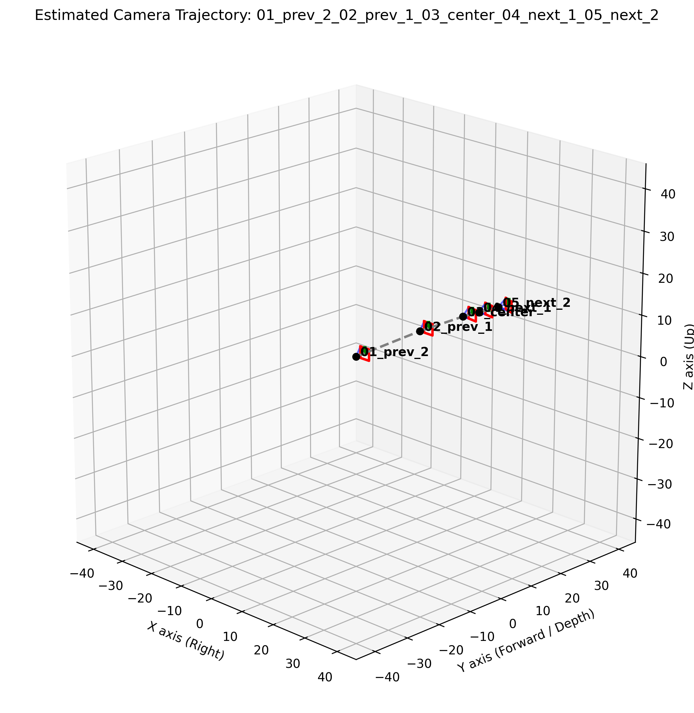
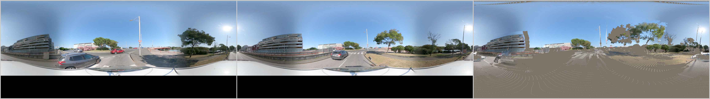
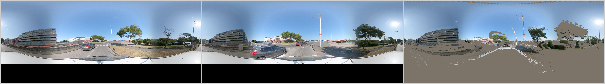
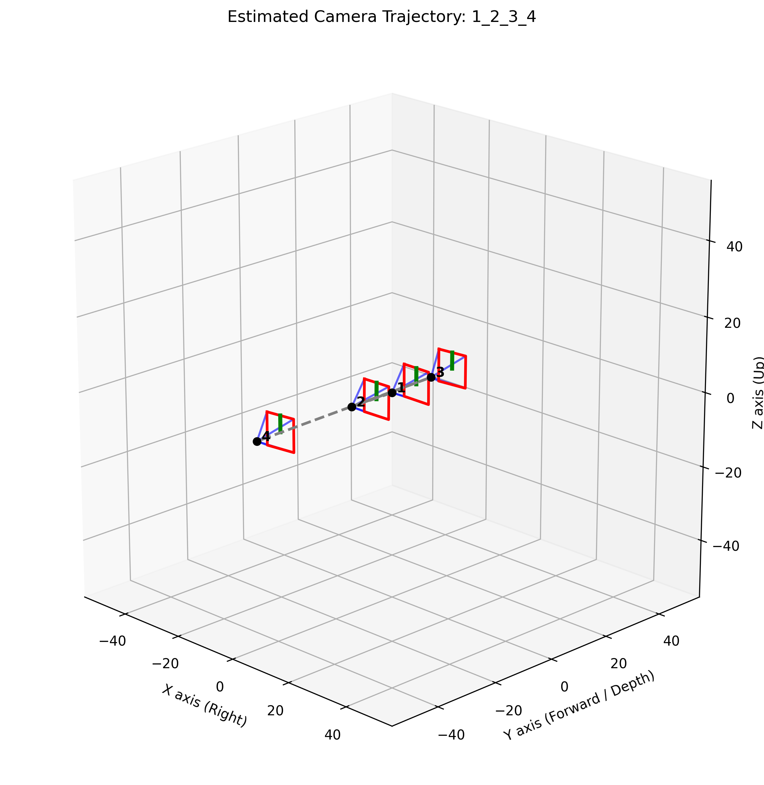
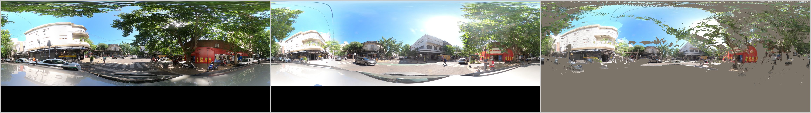
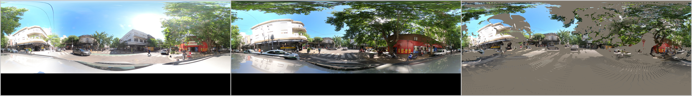

# Panorama Geometry Estimation

Deep camera pose estimation for panoramic (equirectangular) images. This project replaces traditional sparse feature matching with deep monocular geometry models to estimate relative 6-DoF camera poses between panorama pairs, and generates occlusion masks for change-detection pipelines.


## Overview

In the original CYWS-3D pipeline, extrinsic camera parameters (rotation and translation) were estimated using dense point matching and images warped to the viewpoint of the next image using differentiable feature registration module (DFRM). This work modernizes that approach in two directions:

1. **Deep pose estimation via cubemap projection** — equirectangular panoramas are projected into overlapping perspective cubemap faces and fed into deep global SfM models (MapAnything, Depth Anything 3). This sidesteps the heavy distortion that degrades models trained on perspective images.
2. **Spherical geometry in DFRM** — the classical DFRM estimator is extended with spherical (equirectangular) geometry for lifting 2D pixels to 3D, enabling it to operate directly on panoramic images without requiring perspective projection.


## Method

### Step 1: Cubemap Projection

Each panorama is projected into **8 overlapping perspective faces** at 45° yaw intervals. The overlap gives Vision Transformers (ViTs, which use 14×14 pixel patches) enough shared visual context to understand the continuous geometric relationship between faces.

- Face resolution: 518×518 px (configurable)
- Field of view: 90° per face
- Known pinhole intrinsics are injected into the model alongside images

### Step 2: Unified Batch Inference

All 16 faces (8 from Panorama A + 8 from Panorama B) are fed into the deep model in a **single batch**. This forces both panoramas into the same global coordinate system, with Panorama A's front face as the origin `[0, 0, 0]`.

Supported models:
- **MapAnything** (`facebook/map-anything`) — global SfM via transformer
- **Depth Anything 3** (`depth-anything/DA3NESTED-GIANT-LARGE-1.1`) — monocular depth + pose

### Step 3: Translation Consensus

All 8 faces of a panorama share the same physical center point. A geometric consistency filter exploits this:

1. Extract 3D translation vectors for all 8 faces of a panorama.
2. Compute the median center of the cluster.
3. Discard faces outside a strict distance tolerance (configurable via `translation_tolerance`).
4. Average the remaining valid translations → **True Center** of the panorama.

### Step 4: Rotation Extraction via Quaternion Averaging

Each face has a known local yaw offset from the panorama base orientation. The true base rotation is recovered by undoing that offset:

```
R_pano = R_global × R_local⁻¹
```

Because rotation matrices cannot be linearly averaged, valid `R_pano` matrices are:
1. Converted to quaternions.
2. Averaged in quaternion space.
3. Converted back to a 3×3 rotation matrix.

Combining averaged translation and averaged rotation yields a confident 4×4 pose matrix `Rt`.

### DFRM with Spherical Geometry

The classical DFRM estimator is augmented with spherical geometry so it can process equirectangular images natively.

This makes DFRM viable for panoramic input when good correspondences exist, while deep models provide a robust fallback when feature matching degrades.

---

### Pipeline Output — Two Example Sequences

The figures below show the final pipeline output (`execution_mode: pipeline`) for two real sequences.

#### Sequence 1 — `0555c731` (5-panorama street sequence)

**Estimated camera trajectory** — each frustum is one panorama; the 3D layout is recovered entirely from cubemap-based deep pose estimation:



**Occlusion mask example** (`prev_1 → center`) — from left to right, image_1, image_2 and image_2 warped in the viewpoint of image_1.




---

#### Sequence 2 — `argentina_835-Calle-57-La-Plata` (4-panorama street sequence)

**Estimated camera trajectory:**



**Occlusion mask example** (`panorama 1 → panorama 2`):




---

## Project Structure

```
geometry_estimation/
├── main.py                       # Entry point; orchestrates all execution modes
├── DFRMCameraPoseEstimator.py    # Classical DFRM pose estimator with spherical geometry
├── DeepCameraPoseEstimator.py    # Cubemap-based deep pose estimator (MapAnything / DA3)
├── DepthEstimation.py            # Depth model wrappers (DAP, MapAnything)
├── correspondence_extractor.py   # Feature matching (RoMaV2, RoMa, SuperGlue) + RANSAC/MAGSAC
├── geometry.py                   # Spherical & perspective geometry utilities
├── torch_compat_patch.py         # PyTorch version compatibility shims
├── config.yml                    # All runtime settings
├── pyproject.toml                # Package metadata and dependencies
├── run.sh                        # SLURM job submission script
└── vendor/
    ├── DAP/                      # Depth-Any-Panorama
    ├── Depth-Anything-3/         # Depth Anything 3 model
    ├── map-anything/             # MapAnything pose model
    └── RoMaV2/                   # RoMa v2 feature matcher
```

---

## Installation

**Prerequisites:** Python ≥ 3.9, CUDA-capable GPU, Conda.

```bash
# Create and activate environment
conda create -n geometry python=3.9
conda activate geometry

# Install the project (editable)
pip install -e .

# Install vendor package requirements
pip install -r vendor/DAP/requirements.txt
pip install -r vendor/Depth-Anything-3/requirements.txt

# Install PyTorch (CUDA 11.8 example — adjust to your CUDA version)
pip install torch torchvision --index-url https://download.pytorch.org/whl/cu118
```

## Running the Code

All runs share the same entry point. The `execution_mode` field in [config.yml](config.yml) selects what to do:

```bash
python main.py        # reads execution_mode from config.yml
sbatch run.sh         # same, submitted as a SLURM job
```

The four modes form a natural experimental progression:

---

### Mode 1 — `compare_depth`

**Goal:** understand which depth model produces better monocular depth maps on panoramic input before committing to one for the full pipeline.

Runs both **DAP** and **MapAnything** on the same panoramas and saves side-by-side depth visualizations for visual inspection.


### Mode 2 — `compare_pose`

**Goal:** benchmark all three pose estimation approaches against each other to understand their relative strengths and select the best one for the final pipeline.

Runs **DFRM** (with spherical geometry), **MapAnything**, and **Depth Anything 3** on the same panorama pairs and prints a side-by-side comparison table of translation magnitude and Euler angles (yaw / pitch / roll).

### Mode 3 — `occlusion_mask`

**Goal:** generate occlusion masks for a specific pair using poses from three pose estimation approaches.


### Mode 4 — `pipeline` (final, best settings)

**Goal:** end-to-end production run using the best configuration determined from the comparison modes above.

Based on the evaluation results, **MapAnything** for both pose estimation and depth maps, provides the most stable and consistent occlusion masks. This mode:

1. Pre-caches depth maps for all panoramas using MapAnything depth estimation.
2. Runs MapAnything in unified batch mode to compute global `Rt` matrices for every panorama in the sequence.
3. Applies the translation consensus filter and quaternion-averaged rotation to produce robust per-panorama poses.
4. Generates occlusion masks for all panorama pairs in the sequence.


## Citation / Related Work

This project builds on and compares against:

- **CYWS-3D** — the upstream change detection pipeline this work integrates with  
  [ragavsachdeva/CYWS-3D](https://github.com/ragavsachdeva/CYWS-3D)

- **MapAnything** —  [facebookresearch/map-anything](https://github.com/facebookresearch/map-anything)

- **Depth Anything 3** — [ByteDance-Seed/Depth-Anything-3](https://github.com/ByteDance-Seed/Depth-Anything-3)

- **RoMaV2** — robust dense feature matching [Parskatt/romav2](https://github.com/Parskatt/romav2)

- **DAP (Depth-Any-Panorama)** — panoramic depth estimation 
  [Insta360-Research-Team/DAP](https://github.com/Insta360-Research-Team/DAP)
